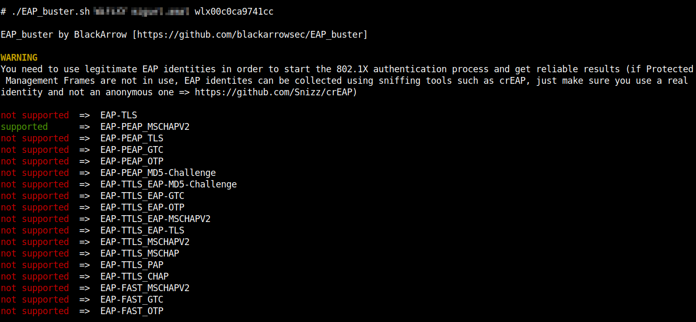
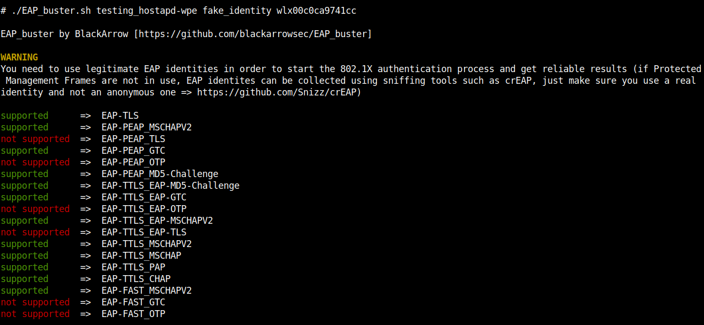

# EAP_buster
 []() []()


<br>
EAP_buster is a simple bash script that lists what EAP methods are supported by the RADIUS server behind a WPA-Enterprise access point. In order to achieve this, it makes use of several wpa_supplicant configuration files along with WPA-Enterprise identities, which can be grabbed with some passive sniffing.

Offensive usage
---------------

During Red Team exercises, EAP_buster provides hints about what to expect from Wi-Fi clients when launching fake WPA-Enterprise access points.

Example: forget about grabbing passwords with fake AP attacks if clients are expected to authenticate through certificates only (EAP-TLS). Usage:
```bash
./EAP_buster.sh "${EAP_ESSID}" "${EAP_identity}" "${wireless_interface}"
```


It should be noted that EAP_buster needs legitimate identities in order to start the 802.1X authentication process and get reliable results.

EAP identites can be passively collected using sniffing tools such as [crEAP](https://github.com/Snizz/crEAP), just make sure you use a real identity and not an anonymous one.

Defensive usage
---------------

From a Systems Administrator standpoint, EAP_buster can be used to detect fake WPA-Enterprise access points, as they tend to support as many EAP methods as possible in order to offer legitimate clients every form of authentication (even if using clearly fake identities).

The following image shows what EAP methods are supported by default when using `hostapd-wpe`:



Installation
------------

No installation process needed, EAP_buster's main functionality consists on launching wpa_supplicant several times.

Author and Credits
---------------
Author: Miguel Amat [@mamatb](https://t.me/m_amatb)

References:

* [EAP packet types](https://github.com/secdev/scapy/blob/master/scapy/layers/eap.py)
* [Typical 802.1X authentication](https://en.wikipedia.org/wiki/IEEE_802.1X#Typical_authentication_progression)
* [wpa_supplicant description](https://github.com/digsrc/wpa_supplicant/blob/master/wpa_supplicant/README)
* [/usr/share/doc/wpasupplicant/examples/wpa_supplicant.conf](https://w1.fi/cgit/hostap/plain/wpa_supplicant/wpa_supplicant.conf)

License
-------

All the code included in this project is licensed under the terms of the MIT license.

#

[](https://www.blackarrow.net) [](https://twitter.com/BlackArrowSec) [](https://www.linkedin.com/company/blackarrowsec/)
